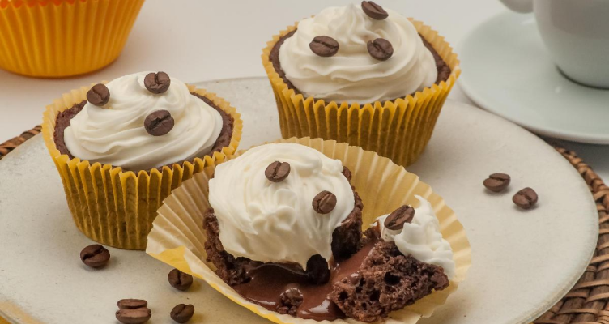

<h1>Página de Receitas 🍳</h1>

Uma página simples e elegante para compartilhar receitas culinárias. 
  Este projeto foi criado utilizando HTML e CSS, com o objetivo de apresentar uma receita de forma clara, organizada e visualmente atrativa.

<h2>🎯 Funcionalidades</h2>
<ul>
<li>Receita detalhada: Inclui uma lista de ingredientes e o passo a passo do preparo.</li>
  <li>Design responsivo: A página é compatível com dispositivos móveis, tablets e desktops.</li>
  <li>Estilo atraente: Elementos visuais tornam a leitura agradável e organizada.</li>
</ul>

<h2>📋 Tecnologias Utilizadas</h2>
<ul>
<li>HTML: Estrutura do conteúdo da receita.</li>
  <li>CSS: Estilo e design responsivo.</li>
</ul>

<h2>🛠️ Estrutura do Projeto</h2>

<h2>🛠️ Exemplo de Código</h2>
<pre>
  <code>
    
    

        
        <main>
     <section id="about">
        <h1>Cupcake de café com chantilly</h1>
        
O bolinho perfeito para acompanhar o café de todos os dias. É muito fácil e ainda por cima fica maravilhoso, com certeza vai impressionar. Faz e depois me conta o que achou!

  </code>
</pre>

<h2>Sobre a aula📚</h2>

Aula ministrada por Mayk Brito

<a href="https://app.rocketseat.com.br/">Visit rocketseat 🚀</a>

